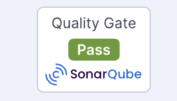

# BEventSustainable

##Sostenibilità Legale e License Compliance

La sostenibilità del software non è solo efficienza energetica, ma anche **manutenibilità legale**.
Questo progetto utilizza **Fossa** per analizzare automaticamente le licenze di tutte le dipendenze open source utilizzate, garantendo che non vi siano conflitti legali  che potrebbero compromettere la distribuzione o il riutilizzo futuro del software.

* **Status:** 100% Compliant
* **Audit:** 70+ dipendenze analizzate
* **Policy:** Compatibilità garantita con licenze MIT, BSD e LGPL (via dynamic linking).

## Validazione Green Coding & Qualità

Parallelamente alla compliance legale, è stata verificata la **qualità strutturale ed energetica** del codice.
L'analisi statica è stata condotta con **SonarQube**, applicando un *Quality Gate* personalizzato ("Green Coding Gate") che prioritizza l'assenza di bug, la sicurezza e l'efficienza algoritmica rispetto alla mera copertura dei test, in linea con i principi di sostenibilità digitale.

* **Quality Gate:** PASSED (Green Coding Profile)
* **Affidabilità:** 0 Bug rilevati (Codice stabile)
* **Sicurezza:** 0 Vulnerabilità (Codice sicuro)
* **Efficienza:** Risoluzione mirata di Code Smells e utilizzo di asset ottimizzati (SVG).

